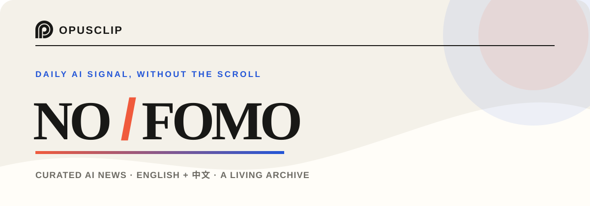

  

  <strong>A calm, curated view of what matters in AI.</strong> 
  Fresh reporting, original sources, and a bilingual archive — designed for a five-minute read.

  
  
  

  
  
  

---

## The signal, minus the noise

NO-FOMO is a daily AI briefing from **OpusClip** for people who want to stay
current without living inside a feed. Each edition brings together the most
useful launches, research, engineering conversations, and independent analysis
from across the AI ecosystem.

<table>
  <tr>
    <td width="33%" valign="top">
      <h3>⚡ Fresh</h3>
      Timely stories are prioritized, with enough context to understand why they matter.
    </td>
    <td width="33%" valign="top">
      <h3>✦ Curated</h3>
      A compact selection replaces endless scrolling and repeated headlines.
    </td>
    <td width="33%" valign="top">
      <h3>↗ Source-first</h3>
      Every item points back to the original article, project, paper, or conversation.
    </td>
  </tr>
</table>

## Five windows into AI

| | Stream | What it brings |
| :---: | --- | --- |
| ✍️ | **Independent blogs** | Thoughtful essays, technical deep dives, and durable ideas |
| 🟧 | **Hacker News** | The conversations developers and founders are having now |
| 𝕏 | **X** | Fast-moving announcements and firsthand commentary |
| ⌘ | **GitHub Trending** | Open-source projects earning real developer attention |
| 🤗 | **Hugging Face** | Models, datasets, demos, and research from the open AI community |

## One edition, two languages

English and Chinese editions share the same editorial selection, so teams can
read and discuss the same stories across languages. The archive keeps every
edition easy to revisit — whether you are looking for yesterday's launch or a
technical post from months ago.

  <a href="https://opus-pro.github.io/NO-FOMO/home/en/"><strong>Explore the English archive →</strong></a>
  &nbsp;&nbsp;&nbsp;
  <a href="https://opus-pro.github.io/NO-FOMO/home/"><strong>浏览中文归档 →</strong></a>

---

  <strong>Built for curiosity, not FOMO.</strong> 
  Curated with AI at OpusClip · Original sources remain the record

