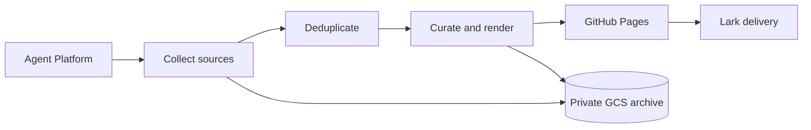

<p align="center">
  
</p>

<p align="center">
  <a href="https://opus-pro.github.io/NO-FOMO/home/"><strong>Browse the archive</strong></a>
  ·
  <a href="https://opus-pro.github.io/NO-FOMO/daily/en/"><strong>Latest in English</strong></a>
  ·
  <a href="https://opus-pro.github.io/NO-FOMO/daily/"><strong>最新中文版</strong></a>
</p>

<p align="center">
  
  
  
  
</p>

## Signal, not scroll

NO-FOMO is a concise, bilingual AI briefing built at OpusClip. It collects the
stories worth knowing across independent blogs, Hacker News, X, GitHub, and
Hugging Face, then publishes a source-linked daily edition without the feed.

| What you get | How it works |
| --- | --- |
| **Fresh signal** | Recent news is prioritized; longer-lived technical posts stay eligible when they add useful context. |
| **Less repetition** | Each run checks the published archive before selecting the next edition. |
| **Original sources** | Every story links back to the source that remains the record. |
| **English + 中文** | Language variants share one edition and one public readership count. |
| **An explorable archive** | 350+ preserved editions and 5,000+ stories use the same responsive editorial design. |

## From signal to page



The scheduled Agent owns collection, deduplication, curation, rendering,
publication, and Lark delivery. Raw and processed run artifacts stay in private
company-managed storage; this repository contains only the public website.

## Repository map

```text
assets/             Shared public client and README artwork
daily/              Stable links to the latest English and Chinese editions
home/               Archive indexes and dated editions
home/YYYY-MM-DD/    One preserved bilingual issue
```

## Public-by-design

- Historical article text, report dates, and original source URLs are preserved.
- Legacy personal links, browser state, and private screenshots are excluded.
- No credentials, PATs, private runtime archives, or personal configuration
  belong in this repository.
- Public aggregate readership uses GoatCounter with referrers suppressed; local
  previews are not counted.

<p align="center"><sub>Curated with AI at OpusClip. Sources remain the record.</sub></p>
